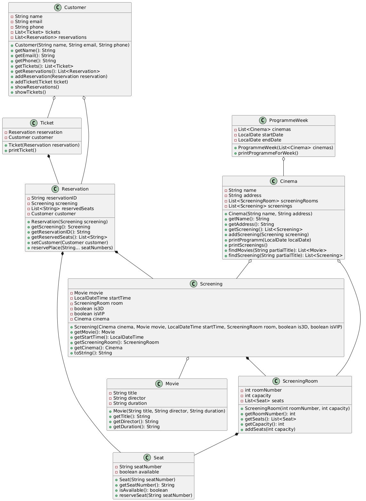

# MultipleksSystem

## Diagram UML 

## Opis projektu
System obsługi multipleksów umożliwiający rezerwację miejsc, zakup biletów oraz przeglądanie repertuaru.

## Funkcjonalności 
- Obsługa wielu kin
- Sprawdzenie repertuaru na dzien, tydzien, dla danego kina
- Rezerwacja i zakup biletów (bez konta)
- Rezerwacja i zakup biletów (z przypisaniem do konta)
- Wyszukiwarka filmów w danym kinie
- Obsługa seansów 3D i VIP
